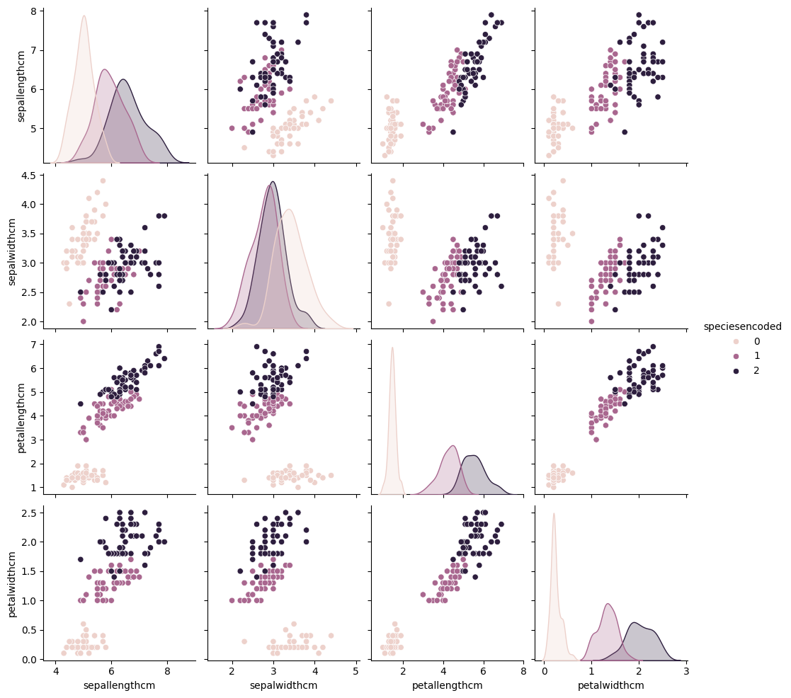
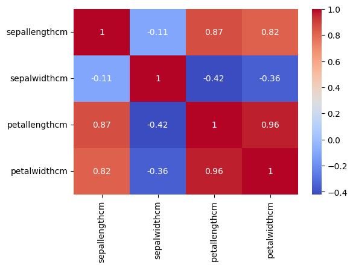
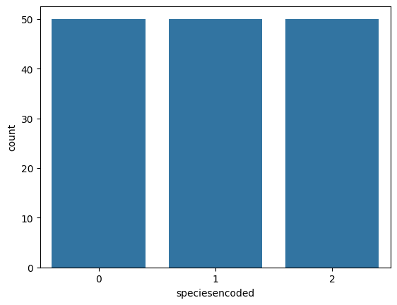

# 🌸 Iris Flower Species Classification

## 📌 Project Overview
This project classifies Iris flowers into **three species** — *Setosa*, *Versicolor*, and *Virginica* — using a machine learning model trained on the classic **Iris dataset**.  

It covers the complete **data science workflow**: data loading, exploratory data analysis (EDA), preprocessing, model training, evaluation, and deployment via a **Streamlit web app** for real-time species prediction.

---

## 🛠️ Tech Stack
**Languages & Libraries**
- Python 3.x
- Pandas, NumPy – Data handling
- Matplotlib, Seaborn – Data visualization
- scikit-learn – Machine Learning models & evaluation
- Joblib – Model persistence
- Streamlit – Web app deployment

---

## 📊 Data Exploration

### Pair Plot – Feature relationships by species

### Heatmap – Feature correlation

---

## 🤖 Model Training & Evaluation
We trained multiple classification algorithms and compared them:

| Model                  | Accuracy |
|------------------------|----------|
| Logistic Regression    | 97%      |
| K-Nearest Neighbors    | 96%      |
| Decision Tree          | 95%      |
| Random Forest          | **98%**  |
| Support Vector Machine | 97%      |

### Accuracy Comparison

The **Random Forest** model achieved the highest accuracy and was chosen for deployment.

---

## 🚀 Deployment
- Created a **Streamlit** web application.
- Users enter sepal & petal measurements using sliders.
- App predicts species and displays **confidence scores** in a **table** and **bar chart** side-by-side.

---

## ▶️ How to Run Locally
1. Clone this repository or download the files.
2. Install dependencies : pip install -r requirements.txt
3. Run the Jupyter Notebook (`iris_dataset.ipynb`) to train and save the model.
4. Run the Streamlit app : streamlit run app.py

---

## 📌 Conclusion
This project demonstrates:
- An **end-to-end ML pipeline** from EDA to web deployment.
- How multiple models can be trained & compared.
- How to build an interactive tool for real-time predictions.

**Future improvements**:
- Deploy on a public server (Streamlit Cloud, Heroku).
- Add cross-validation for improved metrics.
- Enable model selection in the app interface.

---

## 📷 Credits for Images
- `images/pairplot.png` → From notebook EDA step.
- `images/heatmap.png` → From notebook correlation analysis.
- `images/barchart.png` → From model results visualization.

---

**Author:** *Anushka Singh*  
**Dataset Source:** Iris dataset from CSV (Data Analytics Internship)
